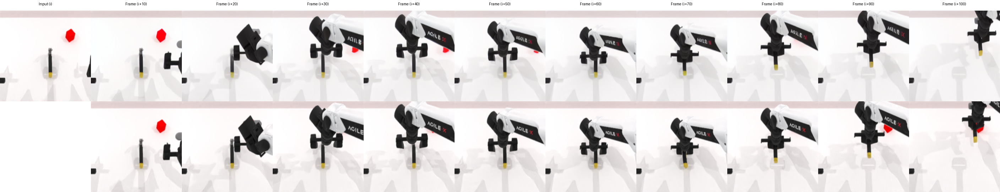

# 🤖 InstructPix2Pix for Robot Visual Trajectory Prediction


*All images above are generated by the fine-tuned model 🤖*

*<!-- TODO: Update this path to point to an actual sample prediction image after running evaluation! -->*

This project explores predicting future visual scenes along a robot's path 🛣️. By fine-tuning the InstructPix2Pix model, we enable generating future frames conditioned on an initial image and a text prompt describing the action. This helps anticipate the robot's environment, crucial for safe and reliable planning!

## 🛠️ Setup Instructions

Follow these steps to set up the environment, download the necessary models, and prepare the data.

1.  **Install Miniconda (if you don't have Conda installed):**

    This command downloads the Miniconda installer, runs it in batch mode, installs it to `~/miniconda`, and then cleans up the installer script.

    ```bash
    wget https://repo.anaconda.com/miniconda/Miniconda3-latest-Linux-x86_64.sh -O ~/miniconda.sh
    bash ~/miniconda.sh -b -p $HOME/miniconda
    rm ~/miniconda.sh
    ```

    Initialize your shell to use Conda. You might need to restart your terminal after running this, or source your shell configuration file (e.g., `source ~/.bashrc`).

    ```bash
    $HOME/miniconda/bin/conda init bash
    # Example for sourcing bashrc if needed:
    # source ~/.bashrc
    ```

2.  **Create Conda Environment:** 📦

    Navigate to the root directory of this project (where the `environment.yaml` file is located) and run the following command. This will create a new Conda environment named `ip2p` with all the required dependencies specified in the `environment.yaml` file.

    ```bash
    conda env create -f environment.yaml
    ```

3.  **Activate the Conda Environment:** ✅

    Before running any scripts, activate the environment you just created:

    ```bash
    conda activate ip2p
    ```

4.  **Download Pretrained Models:** 🧠

    Run the provided script to download the necessary pretrained models from Hugging Face Hub. The models will be saved to the `./model/` directory by default (as configured in `src/save_load_model/download_model.py`).

    ```bash
    bash scripts/download_models.sh
    ```

5.  **Download Dataset:** 💾

    Run the provided script to download and extract both the original dataset (`./data`) and the preprocessed dataset (`./data2`).

    ```bash
    bash scripts/download_data.sh
    ```

6. **Login to WANDB:**
    Log in to Weights & Biases for experiment tracking. You'll need to have a WANDB account and API key ready.

    ```bash
    wandb login --relogin
    ```


After completing these steps, your environment should be ready, the required models downloaded, and the datasets (`./data` and `./data2`) prepared.

## 📊 Data Structure

The dataset downloaded in the setup step is expected to be organized as follows:

```
data/
├── <task_name_1>/         # e.g., blocks_stack_easy_D435
│   ├── episode0/
│   │   ├── ... (image files, state data, action data, etc.)
│   ├── episode1/
│   │   └── ...
│   └── ...
├── <task_name_2>/         # e.g., block_handover_D435
│   ├── episode0/
│   │   └── ...
│   └── ...
└── ...
```

- The root `data` directory contains subdirectories for different robot tasks.
- Each task directory contains multiple `episodeXX` subdirectories.
- Each `episodeXX` directory holds the data recorded during a specific trial or execution of the task (e.g., sequences of images, robot states, actions).

 

## 🚀 Usage

Make sure the `ip2p` conda environment is activated (`conda activate ip2p`) before running the following scripts.

### Training

To train a model, use the `run_training.sh` script located in the `scripts` directory.

```bash
bash scripts/run_training.sh
```

**Key configurations within `scripts/run_training.sh`:**

- `BASE_MODEL`: The pretrained model to start from (Hugging Face ID or local path).
- `DATA_DIR`: Path to the training data directory (default: `./data`).
- `OUTPUT_DIR`: Directory where checkpoints and logs will be saved (default: `./output-1x50`).
- `EPOCHS`, `BATCH_SIZE`, `LEARNING_RATE`: Standard training hyperparameters.
- `GPUS`: Number of GPUs to use (set to 0 for CPU).
- `PRECISION`: Training precision ("16", "32", "bf16").
- `FRAME_OFFSET`: Offset used for selecting image pairs during training.
- `SPLIT_EPISODE`: Episode number used to split data into training and validation sets.
- `MAX_EPISODES`: Maximum number of episodes to use from the dataset.
- `WANDB_PROJECT`, `WANDB_ENTITY`: Optional Weights & Biases logging configuration.

Modify these variables directly within the script before running if needed. Training logs will be saved to `./logs/<OUTPUT_DIR>.log`.

### Saving Checkpoint as Full Model

After training, a checkpoint file (e.g., `last.ckpt`) is typically saved in the `OUTPUT_DIR` specified during training. To convert this checkpoint into a full model directory suitable for evaluation or standalone use (compatible with `src/eval.py`), use the `save_ckpt.sh` script:

```bash
bash scripts/save_ckpt.sh
```

**Key configurations within `scripts/save_ckpt.sh`:**

- `MODEL_NAME`: A name for your converted model. This determines the subdirectory name within `./model/`.
- `CHECKPOINT_FILE`: The path to the input checkpoint file (relative to the project root, e.g., `./output-1x50/checkpoints/last.ckpt`). **Make sure this points to the correct checkpoint you want to convert.**
- `OUTPUT_DIR`: The directory where the full model files will be saved (default: `./model/${MODEL_NAME}`).

Modify these variables in the script, especially `CHECKPOINT_FILE`, to match your training output before running.

### Evaluation

To evaluate a trained model (either a downloaded one or one you converted using `save_ckpt.sh`), use the `run_eval.sh` script located in the `scripts` directory.

```bash
bash scripts/run_eval.sh
```

**Key configurations within `scripts/run_eval.sh`:**

- `MODEL_PATH`: Path to the trained model checkpoint directory (e.g., `./model/ip2p-robotwin-v2-10` or `./output-1x50/checkpoints/last.ckpt`).
- `DATA_DIR`: Path to the evaluation data directory (default: `./data2` - **Note:** this might differ from the training data).
- `EVAL_OUTPUT_DIR`: Directory where evaluation results (e.g., generated images) will be saved.
- `BATCH_SIZE`: Evaluation batch size.
- `GPUS`: Number of GPUs to use (set to 0 for CPU).
- `FRAME_OFFSET`: Frame offset used during evaluation (should ideally match training).
- `EVAL_START_EPISODE`, `EVAL_END_EPISODE`: Range of episodes to use for evaluation (typically the validation set).
- `SAVE_IMAGES`: Set to `true` to save generated images during evaluation.
- `LIMIT_SAMPLES`: Maximum number of samples to evaluate (-1 for no limit).

Modify these variables directly within the script before running. Evaluation results will be saved in the specified `EVAL_OUTPUT_DIR`.

## Acknowledgements

This project builds upon and utilizes resources from the following great works:

*   **RoboTwin:** The dataset and simulation environment originate from the RoboTwin project. We thank the authors for their contribution to the community.
    *   [https://github.com/TianxingChen/RoboTwin](https://github.com/TianxingChen/RoboTwin)
*   **InstructPix2Pix:** The core image generation model is based on the InstructPix2Pix architecture.
    *   [https://github.com/timothybrooks/instruct-pix2pix](https://github.com/timothybrooks/instruct-pix2pix)

Please refer to their respective repositories and papers for more details.

## ✏️ Citation

If you find this project useful in your research, please consider citing it:

```bibtex
@misc{roboip2p2025, 
    author    = {Alfonsus Rendy, Nicholas Oh, William Archieta}, 
    title     = {Next Frame Prediction for Robot Manipulation}, 
    year      = {2025}, 
    publisher = {GitHub},
    journal   = {GitHub repository},
    howpublished = {https://github.com/alfonsusrr/robo-ip2p} 
}
```
